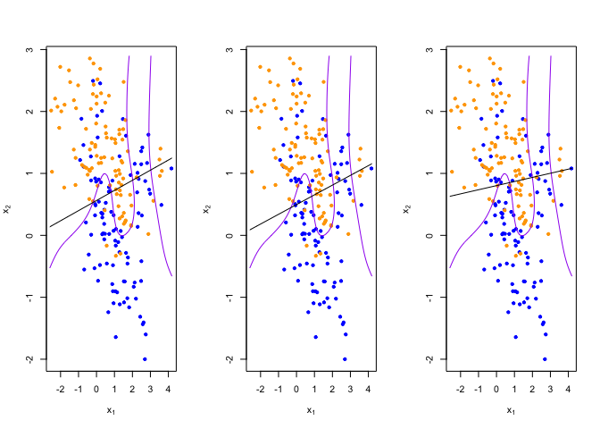
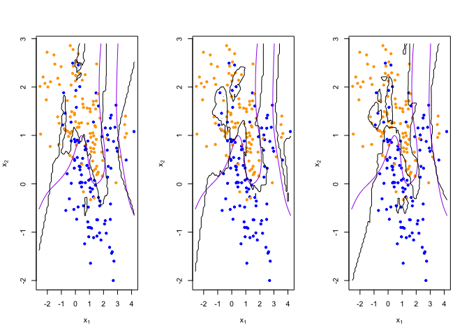
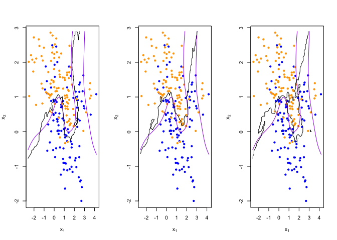

Homework 1
================
Weixi Chen
January 25, 2022

#### Note: I put my code behind the original code.

## Q1: Paste the code and run

``` r
# Import the packages I used
library('class')
library('dplyr')
```

    ## 
    ## Attaching package: 'dplyr'

    ## The following objects are masked from 'package:stats':
    ## 
    ##     filter, lag

    ## The following objects are masked from 'package:base':
    ## 
    ##     intersect, setdiff, setequal, union

``` r
## load binary classification example data from author website 
## 'ElemStatLearn' package no longer available
load(url('https://web.stanford.edu/~hastie/ElemStatLearn/datasets/ESL.mixture.rda'))
dat <- ESL.mixture

plot_mix_data <- expression({
  plot(dat$x[,1], dat$x[,2],
       col=ifelse(dat$y==0, 'blue', 'orange'),
       pch=20,
       xlab=expression(x[1]),
       ylab=expression(x[2]))
  ## draw Bayes (True) classification boundary
  prob <- matrix(dat$prob, length(dat$px1), length(dat$px2))
  cont <- contourLines(dat$px1, dat$px2, prob, levels=0.5)
  rslt <- sapply(cont, lines, col='purple')
})

eval(plot_mix_data)
```

<!-- -->

``` r
## fit linear classifier
fit_lc <- function(y, x) {
  x <- cbind(1, x)
  beta <- drop(solve(t(x)%*%x)%*%t(x)%*%y)
}
```

``` r
## make predictions from linear classifier
predict_lc <- function(x, beta) {
  cbind(1, x) %*% beta
}
```

``` r
## fit model to mixture data and make predictions
lc_beta <- fit_lc(dat$y, dat$x)
lc_pred <- predict_lc(dat$xnew, lc_beta)
```

``` r
## reshape predictions as a matrix
lc_pred <- matrix(lc_pred, length(dat$px1), length(dat$px2))
contour(lc_pred,
      xlab=expression(x[1]),
      ylab=expression(x[2]))
```

<!-- -->

``` r
## find the contours in 2D space such that lc_pred == 0.5
lc_cont <- contourLines(dat$px1, dat$px2, lc_pred, levels=0.5)
```

``` r
## plot data and decision surface
eval(plot_mix_data)
sapply(lc_cont, lines)
```

<!-- -->

    ## [[1]]
    ## NULL

``` r
## fit knn classifier
## use 5-NN to estimate probability of class assignment
knn_fit <- knn(train=dat$x, test=dat$xnew, cl=dat$y, k=5, prob=TRUE)
knn_pred <- attr(knn_fit, 'prob')
knn_pred <- ifelse(knn_fit == 1, knn_pred, 1-knn_pred)
```

``` r
## reshape predictions as a matrix
knn_pred <- matrix(knn_pred, length(dat$px1), length(dat$px2))
contour(knn_pred,
        xlab=expression(x[1]),
        ylab=expression(x[2]),
        levels=c(0.2, 0.5, 0.8))
```

<!-- -->

``` r
## find the contours in 2D space such that knn_pred == 0.5
knn_cont <- contourLines(dat$px1, dat$px2, knn_pred, levels=0.5)
```

``` r
## plot data and decision surface
eval(plot_mix_data)
sapply(knn_cont, lines)
```

<!-- -->

    ## [[1]]
    ## NULL
    ## 
    ## [[2]]
    ## NULL
    ## 
    ## [[3]]
    ## NULL
    ## 
    ## [[4]]
    ## NULL
    ## 
    ## [[5]]
    ## NULL

``` r
## do bootstrap to get a sense of variance in decision surface
resample <- function(dat) {
  idx <- sample(1:length(dat$y), replace = T)
  dat$y <- dat$y[idx]
  dat$x <- dat$x[idx,]
  return(dat)
}
```

``` r
## plot linear classifier for three bootstraps
par(mfrow=c(1,3))
for(b in 1:3) {
  datb <- resample(dat)
  ## fit model to mixture data and make predictions
  lc_beta <- fit_lc(datb$y, datb$x)
  lc_pred <- predict_lc(datb$xnew, lc_beta)
  
  ## reshape predictions as a matrix
  lc_pred <- matrix(lc_pred, length(datb$px1), length(datb$px2))

  ## find the contours in 2D space such that lc_pred == 0.5
  lc_cont <- contourLines(datb$px1, datb$px2, lc_pred, levels=0.5)
  
  ## plot data and decision surface
  eval(plot_mix_data)
  sapply(lc_cont, lines)
}
```

<!-- -->

``` r
## plot 5-NN classifier for three bootstraps
par(mfrow=c(1,3))
for(b in 1:3) {
  datb <- resample(dat)
  
  knn_fit <- knn(train=datb$x, test=datb$xnew, cl=datb$y, k=5, prob=TRUE)
  knn_pred <- attr(knn_fit, 'prob')
  knn_pred <- ifelse(knn_fit == 1, knn_pred, 1-knn_pred)
  
  ## reshape predictions as a matrix
  knn_pred <- matrix(knn_pred, length(datb$px1), length(datb$px2))

  ## find the contours in 2D space such that knn_pred == 0.5
  knn_cont <- contourLines(datb$px1, datb$px2, knn_pred, levels=0.5)
  
  ## plot data and decision surface
  eval(plot_mix_data)
  sapply(knn_cont, lines)
}
```

<!-- -->

``` r
## plot 20-NN classifier for three bootstraps
par(mfrow=c(1,3))
for(b in 1:3) {
  datb <- resample(dat)
  
  knn_fit <- knn(train=datb$x, test=datb$xnew, cl=datb$y, k=20, prob=TRUE)
  knn_pred <- attr(knn_fit, 'prob')
  knn_pred <- ifelse(knn_fit == 1, knn_pred, 1-knn_pred)
  
  ## reshape predictions as a matrix
  knn_pred <- matrix(knn_pred, length(datb$px1), length(datb$px2))
  
  ## find the contours in 2D space such that knn_pred == 0.5
  knn_cont <- contourLines(datb$px1, datb$px2, knn_pred, levels=0.5)
  
  ## plot data and decision surface
  eval(plot_mix_data)
  sapply(knn_cont, lines)
}
```

<!-- -->

## Q2: Read the help file for “lm”

``` r
# Read the R helpfiles for function "lm" and "predict"
?lm
?predict
```

## Q3: Re-write the functions fit_lc and predict_lc

``` r
# Re-write function fit_lc
fit_lc1 <- function(y, x){
# create a data frame to store the independent variables and dependent variable, and change the names.
  data1 = data.frame(x = x, y = y)
# Run lm function to get the linear model
  result <- lm(y ~ x, data = data1)
# Store the results and data into a list, and we can get the coefficients from this list.
  lm_result <- list(data = data1, result = result)
}
```

``` r
# Re-write function predict_lc
predict_lc1 <- function(x, y, newdata) {
# get the linear model by using the train data (y and x)
  fit_result <- fit_lc1(y, x)
# change the data form of newdata (test data) into data.frame
  newdata <- data.frame(newdata)
# Rename the test data as the function "predict" needs the test data to have the same variables' names as the train data.
  names(newdata) <- names(fit_result$data)[-length(names(fit_result$data))]
# use predict function to get the predicted values for the test data
  predict(lm(y ~., fit_result$data), newdata)
}
```

``` r
# model fitting and prediction making
lc_beta1 <- fit_lc1(dat$y, dat$x)$result$coefficients
lc_pred1 <- predict_lc1(dat$x, dat$y, dat$xnew)
```

``` r
# reshape predictions as a matrix
lc_pred1 <- matrix(lc_pred1, length(dat$px1), length(dat$px2))
contour(lc_pred1,
      xlab=expression(x[1]),
      ylab=expression(x[2]))
```

<!-- -->

``` r
# find the contours in 2D space such that lc_pred1 == 0.5
lc_cont1 <- contourLines(dat$px1, dat$px2, lc_pred1, levels=0.5)
```

``` r
# plot data and decision surface
eval(plot_mix_data)
# add the linear classifier
sapply(lc_cont1, lines)
```

<!-- -->

    ## [[1]]
    ## NULL

## Q4: Add squared forms to the model

``` r
## Add the squared terms
x <- cbind(dat$x, dat$x^2)
xnew <- cbind(dat$xnew, dat$xnew^2)
lc_beta2 <- fit_lc1(dat$y, x)$result$coefficients
lc_pred2 <- predict_lc1(x, dat$y, xnew)
```

``` r
# reshape predictions as a matrix
lc_pred2 <- matrix(lc_pred2, length(dat$px1), length(dat$px2))
contour(lc_pred2,
      xlab=expression(x[1]),
      ylab=expression(x[2]))
```

<!-- -->

``` r
# find the contours in 2D space such that lc_pred2 == 0.5
lc_cont2 <- contourLines(dat$px1, dat$px2, lc_pred2, levels=0.5)
```

``` r
# Put the bayes decision surface, lm decision surface, and the more flexible decision surface into the same plot. 
# plot data and decision surface
eval(plot_mix_data)
# add the linear classifier
sapply(lc_cont1, lines)
```

    ## [[1]]
    ## NULL

``` r
# add the more flexible classifier
sapply(lc_cont2, lines, col = "green")
```

    ## [[1]]
    ## NULL

``` r
legend("bottomleft", c("Bayes", "lm", "flexible"), lty = 1, col = c("purple", "black", "green"))
```

<!-- -->

``` r
## do bootstrap to get a sense of variance in decision surface
resample <- function(dat) {
  idx <- sample(1:length(dat$y), replace = T)
  dat$y <- dat$y[idx]
  dat$x <- dat$x[idx,]
  return(dat)
}
```

``` r
set.seed(100)
## plot linear classifier for three bootstraps
par(mfrow=c(1,3))
for(b in 1:3) {
  datb <- resample(dat)
  x <- cbind(datb$x, datb$x^2)
  xnew <- cbind(datb$xnew, datb$xnew^2)
  
  # linear decision surface
  # fit model to mixture data and make predictions
  lc_pred1 <- predict_lc1(datb$x, datb$y, datb$xnew)
  
  # reshape predictions as a matrix
  lc_pred1 <- matrix(lc_pred1, length(datb$px1), length(datb$px2))

  # find the contours in 2D space such that lc_pred1 == 0.5
  lc_cont1 <- contourLines(datb$px1, datb$px2, lc_pred1, levels=0.5)
  
  # more flexible decision surface
  # fit model to mixture data and make predictions
  lc_pred2 <- predict_lc1(x, datb$y, xnew)
  
  # reshape predictions as a matrix
  lc_pred2 <- matrix(lc_pred2, length(datb$px1), length(datb$px2))

  # find the contours in 2D space such that lc_pred2 == 0.5
  lc_cont2 <- contourLines(datb$px1, datb$px2, lc_pred2, levels=0.5)
  
  # plot data and bayes decision surface
  eval(plot_mix_data)
  # add the linear classifier
  sapply(lc_cont1, lines)
  # add the more flexible classifier
  sapply(lc_cont2, lines, col = "green")
  # add the legend
  legend("bottomleft", c("Bayes", "lm", "flexible"), lty = 1, col = c("purple", "black", "green"))
}
```

<!-- -->

In the above plots, it shows the linear decision surface and the more
flexible decision surface of the resample train datasets. From the
different decision surfaces, we can find out that the more flexible one
changes more when the train dataset changes, so we can see that the more
flexible model has a relatively higher variance than the original linear
model. However, the more flexible decision surface is closer to the
Bayes decision surface (the right classifier), so we can see that the
more flexible model has a relatively lower bias than the original linear
model.

## Q5: the bias-variance tradeoff

The model bias is the difference between the model’s prediction and the
true value in the training data (or say targeted value). Bias error
results from simplifying the assumptions used in a model so the target
functions are easier to approximate.

The model variance is the change in the model when using different
portions of the training data sets. Simply stated, variance is the
variability in the model prediction—how much the ML function can adjust
depending on the given data set. Variance comes from highly complex
models with a large number of features.

From the comparison of the linear model and the more flexible model, we
can find out that the more flexible one has a relatively low bias, as it
makes less wrong decision towards different data. However, the more
flexible classifier has a high variance, as the decision surface changes
a lot when the train data changes. Thus, we can conclude that we should
always make a tradeoff between the variance and bias.

Based on the above, we can get a conclusion that the more flexible model
affects the bias-variance tradeoff by lowering the bias and increasing
the variance compared to the original linear model.
