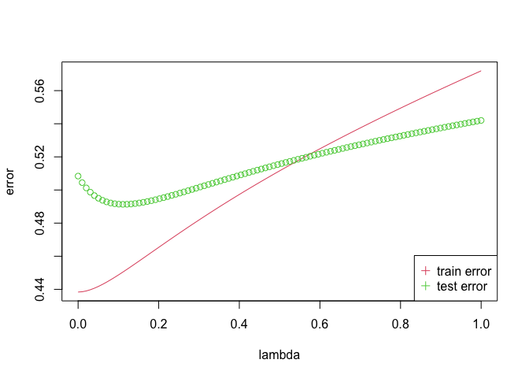

Homework 3
================
Weixi Chen
2/4/2022

## Question1: Use the prostate cancer data

``` r
## load prostate data
prostate <- 
  read.table(url(
    'https://web.stanford.edu/~hastie/ElemStatLearn/datasets/prostate.data'))

## subset to training examples
prostate_train <- subset(prostate, train==TRUE)
```

## Question2: reproduce the correlations

``` r
cor(prostate[, -grep(c('lcavol|lpsa|train'), colnames(prostate))])
```

    ##            lweight       age         lbph         svi          lcp    gleason
    ## lweight 1.00000000 0.3479691  0.442264399  0.15538490  0.164537142 0.05688209
    ## age     0.34796911 1.0000000  0.350185896  0.11765804  0.127667752 0.26889160
    ## lbph    0.44226440 0.3501859  1.000000000 -0.08584324 -0.006999431 0.07782045
    ## svi     0.15538490 0.1176580 -0.085843238  1.00000000  0.673111185 0.32041222
    ## lcp     0.16453714 0.1276678 -0.006999431  0.67311118  1.000000000 0.51483006
    ## gleason 0.05688209 0.2688916  0.077820447  0.32041222  0.514830063 1.00000000
    ## pgg45   0.10735379 0.2761124  0.078460018  0.45764762  0.631528246 0.75190451
    ##              pgg45
    ## lweight 0.10735379
    ## age     0.27611245
    ## lbph    0.07846002
    ## svi     0.45764762
    ## lcp     0.63152825
    ## gleason 0.75190451
    ## pgg45   1.00000000

## Question3, Question4: Use lcavol as the outcome to train the lm model

``` r
result <- lm(lcavol ~ .-train, data = prostate_train)
summary(result)
```

    ## 
    ## Call:
    ## lm(formula = lcavol ~ . - train, data = prostate_train)
    ## 
    ## Residuals:
    ##      Min       1Q   Median       3Q      Max 
    ## -1.71027 -0.50138  0.03103  0.51352  1.35376 
    ## 
    ## Coefficients:
    ##              Estimate Std. Error t value Pr(>|t|)    
    ## (Intercept) -2.173357   1.526699  -1.424    0.160    
    ## lweight     -0.113370   0.236639  -0.479    0.634    
    ## age          0.020102   0.013571   1.481    0.144    
    ## lbph        -0.056981   0.072525  -0.786    0.435    
    ## svi          0.035116   0.313526   0.112    0.911    
    ## lcp          0.418455   0.099521   4.205 9.16e-05 ***
    ## gleason      0.224387   0.198812   1.129    0.264    
    ## pgg45       -0.009113   0.005451  -1.672    0.100 .  
    ## lpsa         0.575455   0.107235   5.366 1.47e-06 ***
    ## ---
    ## Signif. codes:  0 '***' 0.001 '**' 0.01 '*' 0.05 '.' 0.1 ' ' 1
    ## 
    ## Residual standard error: 0.7116 on 58 degrees of freedom
    ## Multiple R-squared:  0.7118, Adjusted R-squared:  0.672 
    ## F-statistic:  17.9 on 8 and 58 DF,  p-value: 3.999e-13

## Question 5: Compute test error

``` r
test_result <- predict(result, prostate[which(prostate$train == 'FALSE'),])
mean((test_result - prostate[which(prostate$train == 'FALSE'),'lcavol'])^2)
```

    ## [1] 0.5084068

``` r
## another method
L2_loss <- function(y, yhat)
  (y-yhat)^2
error <- function(dat, fit, loss=L2_loss)
  mean(loss(dat$lcavol, predict(fit, newdata=dat)))

error(prostate[which(prostate$train == 'FALSE'),], result)
```

    ## [1] 0.5084068

## Question 6, Question7 : Train a ridge regression model and create the figure

``` r
library(ggplot2)
library(glmnet)
```

    ## Loading required package: Matrix

    ## Loaded glmnet 4.1-3

``` r
x_train <- as.matrix(prostate_train[, -grep(c('lcavol|train'), colnames(prostate))])
x_test <- as.matrix(prostate[which(prostate$train == 'FALSE'), -grep(c('lcavol|train'), colnames(prostate))])
y_train <- prostate_train[,'lcavol']
y_test <- prostate[which(prostate$train == 'FALSE'), 'lcavol']
train_error <- c()
test_error <- c()

for(i in seq(0, 1, length.out = 100)){
  cv_fit <- glmnet(x_train, prostate_train$lcavol, alpha = 0, lambda = i)
  cv_predict <- predict(cv_fit, x_test)
  train_error <- c(train_error, mean((predict(cv_fit, x_train) - y_train)^2))
  test_error <- c(test_error, mean((predict(cv_fit, x_test) - y_test)^2))
}

lambda <- seq(0, 1, length.out = 100)
plot(lambda, train_error, type = "l", col = 2, ylab = "error")
lines(lambda, test_error, type = "b", col = 3)
legend("bottomright", c("train error", "test error"), col = c(2, 3), pch = 3)
```

<!-- -->

``` r
lambda_min_testerr <- lambda[which.min(test_error)]
lambda_min_testerr
```

    ## [1] 0.1111111

``` r
# The lambda value that could minimize the test error is 0.1111111
```

## Question 8: Create a path diagram of the ridge regression analysis

``` r
## use glmnet to fit ridge regression
## glmnet fits using penalized L2 loss
## first create an input matrix and output vector
form  <- lcavol ~  lweight + age + lbph + lcp + pgg45 + lpsa + svi + gleason
x_inp <- model.matrix(form, data=prostate_train)
y_out <- prostate_train$lcavol
fit <- glmnet(x=x_inp, y=y_out, lambda=seq(0, 2, 0.05), alpha = 0)
print(fit$beta)
```

    ## 9 x 41 sparse Matrix of class "dgCMatrix"

    ##    [[ suppressing 41 column names 's0', 's1', 's2' ... ]]

    ##                                                                        
    ## (Intercept) .           .           .           .           .          
    ## lweight     0.136138336 0.136607196 0.137051610 0.137466423 0.137847992
    ## age         0.008862088 0.008934571 0.009009252 0.009085714 0.009164059
    ## lbph        0.001821849 0.001657784 0.001487189 0.001306032 0.001113551
    ## lcp         0.145082951 0.146707652 0.148396232 0.150134290 0.151924594
    ## pgg45       0.002626018 0.002616461 0.002605639 0.002593201 0.002579010
    ## lpsa        0.195398084 0.197865598 0.200408926 0.203032989 0.205742384
    ## svi         0.350457898 0.352900683 0.355333943 0.357770900 0.360208264
    ## gleason     0.119916215 0.120485880 0.121045891 0.121604258 0.122160639
    ##                                                                              
    ## (Intercept) .            .            .            .             .           
    ## lweight     0.1381923122 0.1384949177 0.1387508177 0.1389544268  1.390995e-01
    ## age         0.0092444047 0.0093268792 0.0094116252 0.0094988013  9.588585e-03
    ## lbph        0.0009089003 0.0006911549 0.0004592982 0.0002122111 -5.134109e-05
    ## lcp         0.1537701424 0.1556742027 0.1576403471 0.1596724914  1.617749e-01
    ## pgg45       0.0025629104 0.0025447336 0.0025242915 0.0025013757  2.475755e-03
    ## lpsa        0.2085420822 0.2114374915 0.2144345047 0.2175395599  2.207597e-01
    ## svi         0.3626422623 0.3650685529 0.3674821409 0.3698772755  3.722473e-01
    ## gleason     0.1227147046 0.1232661305 0.1238146002 0.1243598144  1.249015e-01
    ##                                                                                
    ## (Intercept)  .             .             .             .            .          
    ## lweight      0.1391789465  0.1391848963  0.1391083887  0.138939306  0.138666174
    ## age          0.0096811725  0.0097767872  0.0098756786  0.009978129  0.010084457
    ## lbph        -0.0003327238 -0.0006334514 -0.0009552077 -0.001299871 -0.001669541
    ## lcp          0.1639524378  0.1662102354  0.1685541586  0.170990697  0.173527106
    ## pgg45        0.0024471704  0.0024153350  0.0023799255  0.002340579  0.002296887
    ## lpsa         0.2241026892  0.2275770284  0.2311921369  0.234958439  0.238887518
    ## svi          0.3745846643  0.3768804492  0.3791244750  0.381304908  0.383408007
    ## gleason      0.1254394276  0.1259734189  0.1265033777  0.127029312  0.127551371
    ##                                                                             
    ## (Intercept)  .            .            .            .            .          
    ## lweight      0.138275937  0.137753707  0.137082442  0.136242575  0.135254219
    ## age          0.010195028  0.010310256  0.010430618  0.010556660  0.010691304
    ## lbph        -0.002066578 -0.002493638 -0.002953727 -0.003450255 -0.003987245
    ## lcp          0.176171531  0.178933155  0.181822375  0.184851026  0.188068235
    ## pgg45        0.002248386  0.002194552  0.002134784  0.002068397  0.001993630
    ## lpsa         0.242992289  0.247287205  0.251788502  0.256514494  0.261465760
    ## svi          0.385417770  0.387315525  0.389079405  0.390683731  0.392060978
    ## gleason      0.128069888  0.128585441  0.129098925  0.129611653  0.130128679
    ##                                                                           
    ## (Intercept)  .           .            .            .           .          
    ## lweight      0.13401037  0.132519135  0.130744991  0.12864629  0.126173874
    ## age          0.01083092  0.010978453  0.011134907  0.01130146  0.011479518
    ## lbph        -0.00456948 -0.005201756 -0.005890082 -0.00664143 -0.007463984
    ## lcp          0.19142083  0.194960229  0.198707284  0.20268660  0.206927271
    ## pgg45        0.00191131  0.001819573  0.001717172  0.00160264  0.001474237
    ## lpsa         0.26670371  0.272237533  0.278098368  0.28432224  0.290951107
    ## svi          0.39324788  0.394166509  0.394766200  0.39498592  0.394751914
    ## gleason      0.13064905  0.131177220  0.131718104  0.13227818  0.132866067
    ##                                                                                
    ## (Intercept)  .            .            .             .             .           
    ## lweight      0.123269424  0.119863280  0.1158716818  0.1111931576  0.1057367423
    ## age          0.011670740  0.011877123  0.0121010799  0.0123455384  0.0126162948
    ## lbph        -0.008367417 -0.009363256 -0.0104653587 -0.0116905450 -0.0130587545
    ## lcp          0.211463925  0.216338199  0.2216006089  0.2273130852  0.2336122365
    ## pgg45        0.001329887  0.001167084  0.0009827841  0.0007732439  0.0005320808
    ## lpsa         0.298034210  0.305629735  0.3138070249  0.3226494596  0.3322362737
    ## svi          0.393974524  0.392543942  0.3903246503  0.3871479640  0.3827345083
    ## gleason      0.133493280  0.134175190  0.1349324324  0.1357928799  0.1368039677
    ##                                                                    
    ## (Intercept)  .             .             .             .           
    ## lweight      0.0992845548  9.167569e-02  0.0826683974  0.0719539790
    ## age          0.0129137196  1.324527e-02  0.0136179442  0.0140406458
    ## lbph        -0.0145982826 -1.633988e-02 -0.0183250234 -0.0206075810
    ## lcp          0.2404842462  2.481056e-01  0.2566365841  0.2662889676
    ## pgg45        0.0002563424 -6.281817e-05 -0.0004352185 -0.0008738898
    ## lpsa         0.3427336970  3.542772e-01  0.3670625821  0.3813402190
    ## svi          0.3769402232  3.693573e-01  0.3595330231  0.3468674177
    ## gleason      0.1380061651  1.394762e-01  0.1413173664  0.1436779613
    ##                                                                             
    ## (Intercept)  .            .            .            .            .          
    ## lweight      0.059127616  0.043652593  0.024777969  0.001504802 -0.027603986
    ## age          0.014526957  0.015088490  0.015748487  0.016532948  0.017480107
    ## lbph        -0.023258103 -0.026377963 -0.030098852 -0.034621150 -0.040241264
    ## lcp          0.277447149  0.290342311  0.305728439  0.324372008  0.347616547
    ## pgg45       -0.001398912 -0.002031353 -0.002810371 -0.003788173 -0.005050263
    ## lpsa         0.397429712  0.415786556  0.437009864  0.461951799  0.491849702
    ## svi          0.330415198  0.309283880  0.281608260  0.245177911  0.196427346
    ## gleason      0.146778188  0.150949425  0.156678907  0.164800413  0.176722769
    ##                                      
    ## (Intercept)  .            .          
    ## lweight     -0.064680201 -0.113137304
    ## age          0.018643148  0.020098181
    ## lbph        -0.047425776 -0.056962692
    ## lcp          0.377657417  0.418431830
    ## pgg45       -0.006739814 -0.009116838
    ## lpsa         0.528596455  0.575318051
    ## svi          0.129711598  0.035342349
    ## gleason      0.194999807  0.224585243

``` r
## functions to compute testing/training error with glmnet
error <- function(dat, fit, lam, form, loss=L2_loss) {
  x_inp <- model.matrix(form, data=dat)
  y_out <- dat$lcavol
  y_hat <- predict(fit, newx=x_inp, s=lam)  ## see predict.elnet
  mean(loss(y_out, y_hat))
}


## plot path diagram
plot(x=range(fit$lambda),
     y=range(as.matrix(fit$beta)),
     type='n',
     xlab=expression(lambda),
     ylab='Coefficients')
for(i in 1:nrow(fit$beta)) {
  points(x=fit$lambda, y=fit$beta[i,], pch=19, col='#00000055')
  lines(x=fit$lambda, y=fit$beta[i,], col='#00000055')
}
text(x=0, y=fit$beta[,ncol(fit$beta)], 
     labels=rownames(fit$beta),
     xpd=NA, pos=4, srt=45)
abline(h=0, lty=3, lwd=2)
```

<!-- -->
