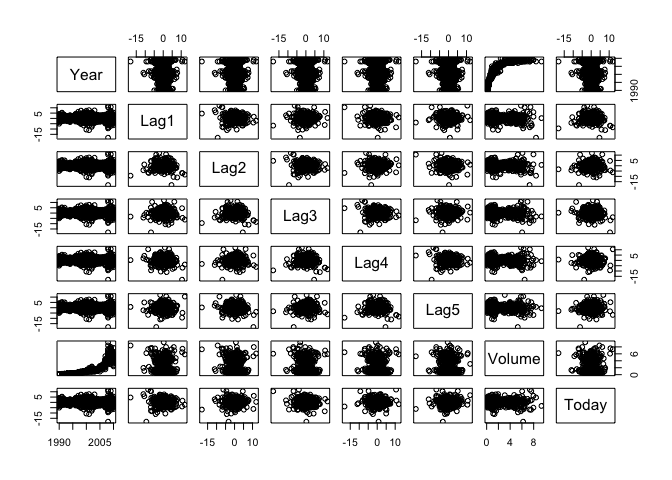

Homework4
================
Weixi Chen
2/16/2022

## Exercise 4

### a

Considering that X is evenly distributed, so the fraction of available
observations we will use is 10%.

### b

We use 1% of the available dataset on average, as we use 10% data from
both X1 and X2, and then we will use 10% \* 10% = 1% data on average.

### c

We will use (10%)<sup>100</sup> of data on average, and the reason is
the same as the question b.

### d

Every time when the dimension, p, increase by 1, the available data we
use for predicting observation will decrease by 10%. So, when the
dimension p is very large, there will be few training observations near
any given test observations.

### e

To make sure that we can use 10% of the available training data, we
should let 10% of data be included into the hypercube. So the length of
each side should meet the condition:

*l*<sup>100</sup> = 10

And we can get the result as: $l = \\sqrt\[100\]{10\\%}$

## Exercise 10

### a

``` r
library(ISLR2)
```

    ## Warning: package 'ISLR2' was built under R version 4.1.2

``` r
data(Weekly)
```

``` r
summary(Weekly[, -9])
```

    ##       Year           Lag1               Lag2               Lag3         
    ##  Min.   :1990   Min.   :-18.1950   Min.   :-18.1950   Min.   :-18.1950  
    ##  1st Qu.:1995   1st Qu.: -1.1540   1st Qu.: -1.1540   1st Qu.: -1.1580  
    ##  Median :2000   Median :  0.2410   Median :  0.2410   Median :  0.2410  
    ##  Mean   :2000   Mean   :  0.1506   Mean   :  0.1511   Mean   :  0.1472  
    ##  3rd Qu.:2005   3rd Qu.:  1.4050   3rd Qu.:  1.4090   3rd Qu.:  1.4090  
    ##  Max.   :2010   Max.   : 12.0260   Max.   : 12.0260   Max.   : 12.0260  
    ##       Lag4               Lag5              Volume            Today         
    ##  Min.   :-18.1950   Min.   :-18.1950   Min.   :0.08747   Min.   :-18.1950  
    ##  1st Qu.: -1.1580   1st Qu.: -1.1660   1st Qu.:0.33202   1st Qu.: -1.1540  
    ##  Median :  0.2380   Median :  0.2340   Median :1.00268   Median :  0.2410  
    ##  Mean   :  0.1458   Mean   :  0.1399   Mean   :1.57462   Mean   :  0.1499  
    ##  3rd Qu.:  1.4090   3rd Qu.:  1.4050   3rd Qu.:2.05373   3rd Qu.:  1.4050  
    ##  Max.   : 12.0260   Max.   : 12.0260   Max.   :9.32821   Max.   : 12.0260

``` r
pairs(Weekly[, -9])
```

<!-- -->

``` r
cor(Weekly[, -9])
```

    ##               Year         Lag1        Lag2        Lag3         Lag4
    ## Year    1.00000000 -0.032289274 -0.03339001 -0.03000649 -0.031127923
    ## Lag1   -0.03228927  1.000000000 -0.07485305  0.05863568 -0.071273876
    ## Lag2   -0.03339001 -0.074853051  1.00000000 -0.07572091  0.058381535
    ## Lag3   -0.03000649  0.058635682 -0.07572091  1.00000000 -0.075395865
    ## Lag4   -0.03112792 -0.071273876  0.05838153 -0.07539587  1.000000000
    ## Lag5   -0.03051910 -0.008183096 -0.07249948  0.06065717 -0.075675027
    ## Volume  0.84194162 -0.064951313 -0.08551314 -0.06928771 -0.061074617
    ## Today  -0.03245989 -0.075031842  0.05916672 -0.07124364 -0.007825873
    ##                Lag5      Volume        Today
    ## Year   -0.030519101  0.84194162 -0.032459894
    ## Lag1   -0.008183096 -0.06495131 -0.075031842
    ## Lag2   -0.072499482 -0.08551314  0.059166717
    ## Lag3    0.060657175 -0.06928771 -0.071243639
    ## Lag4   -0.075675027 -0.06107462 -0.007825873
    ## Lag5    1.000000000 -0.05851741  0.011012698
    ## Volume -0.058517414  1.00000000 -0.033077783
    ## Today   0.011012698 -0.03307778  1.000000000

We can find that there strong correlation (0.842) between variable
‘Year’ and ‘Volume’, and the correlations between other variables are
weak.

### b

``` r
summary(Weekly$Direction)
```

    ## Down   Up 
    ##  484  605

``` r
logistic1 <- glm(Direction ~ Lag1 + Lag2 + Lag3 + Lag4 + Lag5 + Volume, data = Weekly, family = 'binomial')
summary(logistic1)
```

    ## 
    ## Call:
    ## glm(formula = Direction ~ Lag1 + Lag2 + Lag3 + Lag4 + Lag5 + 
    ##     Volume, family = "binomial", data = Weekly)
    ## 
    ## Deviance Residuals: 
    ##     Min       1Q   Median       3Q      Max  
    ## -1.6949  -1.2565   0.9913   1.0849   1.4579  
    ## 
    ## Coefficients:
    ##             Estimate Std. Error z value Pr(>|z|)   
    ## (Intercept)  0.26686    0.08593   3.106   0.0019 **
    ## Lag1        -0.04127    0.02641  -1.563   0.1181   
    ## Lag2         0.05844    0.02686   2.175   0.0296 * 
    ## Lag3        -0.01606    0.02666  -0.602   0.5469   
    ## Lag4        -0.02779    0.02646  -1.050   0.2937   
    ## Lag5        -0.01447    0.02638  -0.549   0.5833   
    ## Volume      -0.02274    0.03690  -0.616   0.5377   
    ## ---
    ## Signif. codes:  0 '***' 0.001 '**' 0.01 '*' 0.05 '.' 0.1 ' ' 1
    ## 
    ## (Dispersion parameter for binomial family taken to be 1)
    ## 
    ##     Null deviance: 1496.2  on 1088  degrees of freedom
    ## Residual deviance: 1486.4  on 1082  degrees of freedom
    ## AIC: 1500.4
    ## 
    ## Number of Fisher Scoring iterations: 4

From the summary of result, we can find out that only the variable
‘Lag2’ is statistically significant at the 5% confidence level.

### c

``` r
logistic1_pred <- predict(logistic1, type = "response")
logistic1_result <- lapply(logistic1_pred, function(x) ifelse(x > 0.5, 'Up', 'Down'))
table(as.vector(unlist(logistic1_result)), Weekly$Direction)
```

    ##       
    ##        Down  Up
    ##   Down   54  48
    ##   Up    430 557

From the table above, we can find out that the mistake that the logistic
model made is that it always recognized the ‘Down’ direction as ‘Up’.
And the accuracy is (54 + 557)/1089 = 56.1%

### d

``` r
train_data = Weekly[Weekly[, 'Year'] < 2009, ]
test_data = Weekly[Weekly[, 'Year'] > 2008, ]
```

``` r
logistic2 <- glm(Direction ~ Lag2, data = train_data, family = 'binomial')
logistic2_pred <- predict(logistic2, test_data[, -9], type = "response")
logistic2_result <- lapply(logistic2_pred, function(x) ifelse(x > 0.5, 'Up', 'Down'))
table(as.vector(unlist(logistic2_result)), test_data$Direction)
```

    ##       
    ##        Down Up
    ##   Down    9  5
    ##   Up     34 56

We can see that the fraction of correct predictions is (9 + 56)/104 =
62.5%

### e

``` r
library(MASS)
```

    ## 
    ## Attaching package: 'MASS'

    ## The following object is masked from 'package:ISLR2':
    ## 
    ##     Boston

``` r
lda1 <- lda(Direction ~ Lag2, train_data)
lda1_pred <- predict(lda1, test_data)
table(lda1_pred$class, test_data$Direction)
```

    ##       
    ##        Down Up
    ##   Down    9  5
    ##   Up     34 56

The overall fraction of correct predictions is (9 + 56)/104 = 62.5%

### f

``` r
qda1 <- qda(Direction ~ Lag2, train_data)
qda1_pred <- predict(qda1, test_data)
table(qda1_pred$class, test_data$Direction)
```

    ##       
    ##        Down Up
    ##   Down    0  0
    ##   Up     43 61

The overall fraction of correct predictions is (0 + 61)/104 = 58.7%

### g

``` r
library(class)
set.seed(1)
train_data1 = as.matrix(train_data[, 'Lag2'])
train_direction = train_data$Direction
test_data1  = as.matrix(test_data[, 'Lag2'])
knn1_pred <- knn(train_data1, test_data1, train_direction, k = 1)
table(knn1_pred, test_data$Direction)
```

    ##          
    ## knn1_pred Down Up
    ##      Down   21 30
    ##      Up     22 31

The overall fraction of correct predictions is (21 + 31)/104 = 50%

### h

``` r
library(e1071)
naiveBayes1 <- naiveBayes(train_data1, train_direction, laplace = 0)
naiveBayes_pred <- predict(naiveBayes1, test_data1, type = "class")
table(naiveBayes_pred, test_data$Direction)
```

    ##                
    ## naiveBayes_pred Down Up
    ##            Down    0  0
    ##            Up     43 61

The overall fraction of correct predictions is (61 + 0)/104 = 58.7%

### i

The logistics model and LDA methods seem to provide the best prediction
results on this data.

### j

Considering use variable “Lag1”, “Lag2”, and the interaction of “Lag1”
and “Lag2”.

#### Logistic model

``` r
logistic3 <- glm(Direction ~ Lag1 + Lag2 + Lag1:Lag2, data = train_data, family = 'binomial')
logistic3_pred <- predict(logistic3, test_data[, -9], type = "response")
logistic3_result <- lapply(logistic3_pred, function(x) ifelse(x > 0.5, 'Up', 'Down'))
table(as.vector(unlist(logistic3_result)), test_data$Direction)
```

    ##       
    ##        Down Up
    ##   Down    7  8
    ##   Up     36 53

The overall fraction of correct predictions is (53 + 7)/104 = 57.7%

#### LDA model

``` r
library(MASS)
lda2 <- lda(Direction ~ Lag1 + Lag2 + Lag1:Lag2, train_data)
lda2_pred <- predict(lda2, test_data)
table(lda2_pred$class, test_data$Direction)
```

    ##       
    ##        Down Up
    ##   Down    7  8
    ##   Up     36 53

The overall fraction of correct predictions is (7 + 53)/104 = 57.7%

#### QDA model

``` r
qda2 <- qda(Direction ~ Lag1 + Lag2 + Lag1:Lag2, train_data)
qda2_pred <- predict(qda2, test_data)
table(qda2_pred$class, test_data$Direction)
```

    ##       
    ##        Down Up
    ##   Down   23 36
    ##   Up     20 25

The overall fraction of correct predictions is (23 + 25)/104 = 46.2%

#### knn k = 10

``` r
library(class)
set.seed(2)
knn2_pred <- knn(train_data1, test_data1, train_direction, k = 10)
table(knn2_pred, test_data$Direction)
```

    ##          
    ## knn2_pred Down Up
    ##      Down   18 21
    ##      Up     25 40

The overall fraction of correct predictions is (18 + 40)/104 = 55.8%

The logistic model and LDA model still seems to be the best models.
