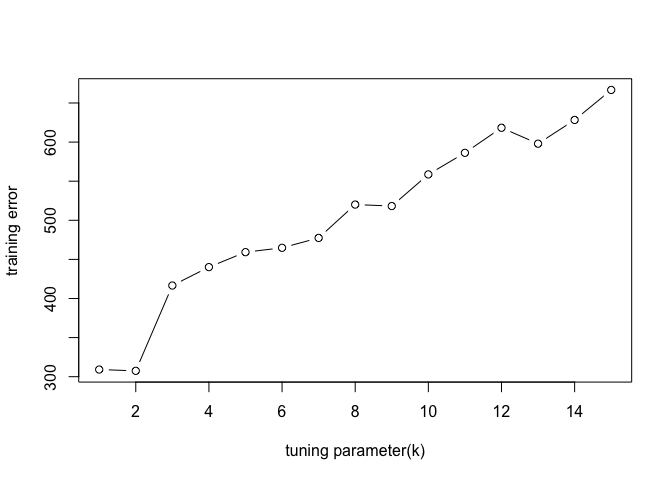
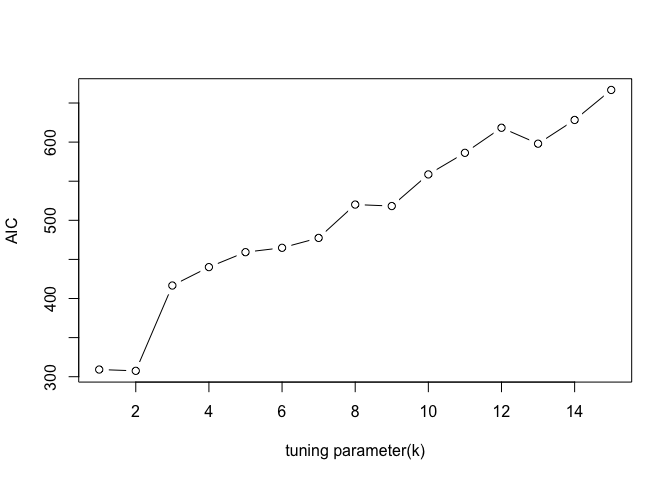
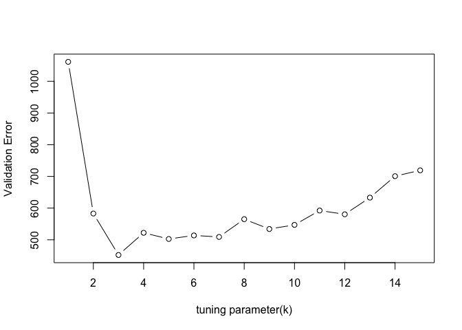
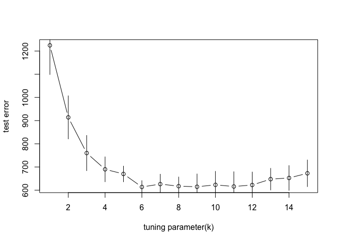

Homework5
================
Weixi Chen
2/23/2022

# homework 5

``` r
# read the dataset we need
library('MASS') ## for 'mcycle'
library('manipulate') ## for 'manipulate'

y <- mcycle$accel
x <- matrix(mcycle$times, length(mcycle$times), 1)

data(mcycle)

plot(x, y, xlab="Time (ms)", ylab="Acceleration (g)")
```

<!-- -->

## Question1: randomly split the mcycle data

``` r
set.seed(1)
training_index <- sample(1:nrow(mcycle), dim(mcycle)[1]*0.75)
training_data <- mcycle[training_index, ]
validation_data <- mcycle[-training_index, ]
```

## Question2: Use Nadaraya-Waston method with the k-NN kernel function to predict the mean acceleration as a function of time

``` r
## k-NN kernel function
## x  - n x p matrix of training inputs
## x0 - 1 x p input where to make prediction
## k  - number of nearest neighbors
kernel_k_nearest_neighbors <- function(x, x0, k=1) {
  ## compute distance betwen each x and x0
  z <- t(t(x) - x0)
  d <- sqrt(rowSums(z*z))

  ## initialize kernel weights to zero
  w <- rep(0, length(d))
  
  ## set weight to 1 for k nearest neighbors
  w[order(d)[1:k]] <- 1
  
  return(w)
}
```

``` r
## Make predictions using the NW method
## y  - n x 1 vector of training outputs
## x  - n x p matrix of training inputs
## x0 - m x p matrix where to make predictions
## kern  - kernel function to use
## ... - arguments to pass to kernel function
nadaraya_watson <- function(y, x, x0, kern, ...) {
  k <- t(apply(x0, 1, function(x0_) {
    k_ <- kern(x, x0_, ...)
    k_/sum(k_)
  }))
  yhat <- drop(k %*% y)
  return(yhat)
}
```

``` r
# we can get the predictions by using the function
nadaraya_watson(as.matrix(training_data$accel), as.matrix(training_data$times), as.matrix(validation_data$times), kernel_k_nearest_neighbors)
```

    ##  [1]   -1.3   -1.3   -1.3   -2.7   -2.7   -5.4   -9.3  -21.5  -50.8 -101.9
    ## [11] -104.4 -112.5  -72.3  -72.3  -72.3  -72.3  -72.3 -123.1 -123.1 -123.1
    ## [21]  -81.8  -21.5  -21.5    9.5    9.5  -21.5  -21.5  -17.4    8.1   32.1
    ## [31]  -13.3   14.7   10.7  -14.7

``` r
# also we can change the tuning parameter k in 'kernel_k_nearest_neighbors' to get a series of prediction models.
```

## Question3: compute and plot the training error, AIC, BIC, and validation error

``` r
# the training error

## loss function
## y    - train/test y
## yhat - predictions at train/test x
loss_squared_error <- function(y, yhat)
  (y - yhat)^2

k1 <- seq(1, 15, 1)

y_hat <- matrix(NA, nrow = dim(training_data)[1], ncol = length(k1))

for (k2 in k1){
  kernel_k_nearest_neighbors <- function(x, x0, k = k2) {
  ## compute distance betwen each x and x0
  z <- t(t(x) - x0)
  d <- sqrt(rowSums(z*z))

  ## initialize kernel weights to zero
  w <- rep(0, length(d))
  
  ## set weight to 1 for k nearest neighbors
  w[order(d)[1:k]] <- 1
  
  return(w)
}
  
  y_hat[,k2] <- nadaraya_watson(as.matrix(training_data$accel), as.matrix(training_data$times), as.matrix(training_data$times), kernel_k_nearest_neighbors)
}

## test/train error
## y    - train/test y
## yhat - predictions at train/test x
## loss - loss function
error <- function(y, yhat, loss=loss_squared_error)
  mean(loss(y, yhat))

training_error <- c()
for(x in 1:dim(y_hat)[2]){
  training_error <- c(training_error, error(training_data$accel, y_hat[,x]))
}

plot(k1, training_error, type = "b", xlab = "tuning parameter(k)", ylab = "training error")
```

<!-- -->

``` r
# AIC
k1 <- seq(1, 15, 1)

y_hat <- matrix(NA, nrow = dim(training_data)[1], ncol = length(k1))

for (k2 in k1){
  kernel_k_nearest_neighbors <- function(x, x0, k = k2) {
  ## compute distance betwen each x and x0
  z <- t(t(x) - x0)
  d <- sqrt(rowSums(z*z))

  ## initialize kernel weights to zero
  w <- rep(0, length(d))
  
  ## set weight to 1 for k nearest neighbors
  w[order(d)[1:k]] <- 1
  
  return(w)
}
  
  y_hat[,k2] <- nadaraya_watson(as.matrix(training_data$accel), as.matrix(training_data$times), as.matrix(training_data$times), kernel_k_nearest_neighbors)
}

## y    - training y
## yhat - predictions at training x
## d    - effective degrees of freedom
aic <- function(y, yhat, d)
  error(y, yhat) + 2/length(y)*d

aic1 <- c()
for(x in 1:dim(y_hat)[2]){
  aic1 <- c(aic1, aic(training_data$accel, y_hat[,x], d = 1))
}

plot(k1, aic1, type = "b", xlab = "tuning parameter(k)", ylab = "AIC")
```

<!-- -->

``` r
# BIC
k1 <- seq(1, 15, 1)

y_hat <- matrix(NA, nrow = dim(training_data)[1], ncol = length(k1))

for (k2 in k1){
  kernel_k_nearest_neighbors <- function(x, x0, k = k2) {
  ## compute distance betwen each x and x0
  z <- t(t(x) - x0)
  d <- sqrt(rowSums(z*z))

  ## initialize kernel weights to zero
  w <- rep(0, length(d))
  
  ## set weight to 1 for k nearest neighbors
  w[order(d)[1:k]] <- 1
  
  return(w)
}
  
  y_hat[,k2] <- nadaraya_watson(as.matrix(training_data$accel), as.matrix(training_data$times), as.matrix(training_data$times), kernel_k_nearest_neighbors)
}

## y    - training y
## yhat - predictions at training x
## d    - effective degrees of freedom
bic <- function(y, yhat, d)
  error(y, yhat) + log(length(y))/length(y)*d

bic1 <- c()
for(x in 1:dim(y_hat)[2]){
  bic1 <- c(bic1, bic(training_data$accel, y_hat[,x], d = 1))
}

plot(k1, bic1, type = "b", xlab = "tuning parameter(k)", ylab = "BIC")
```

<!-- -->

``` r
# Validation Error
k1 <- seq(1, 15, 1)

y_hat <- matrix(NA, nrow = dim(validation_data)[1], ncol = length(k1))

for (k2 in k1){
  kernel_k_nearest_neighbors <- function(x, x0, k = k2) {
  ## compute distance betwen each x and x0
  z <- t(t(x) - x0)
  d <- sqrt(rowSums(z*z))

  ## initialize kernel weights to zero
  w <- rep(0, length(d))
  
  ## set weight to 1 for k nearest neighbors
  w[order(d)[1:k]] <- 1
  
  return(w)
}
  
  y_hat[,k2] <- nadaraya_watson(as.matrix(training_data$accel), as.matrix(training_data$times), as.matrix(validation_data$times), kernel_k_nearest_neighbors)
}

## test/train error
## y    - train/test y
## yhat - predictions at train/test x
## loss - loss function
error <- function(y, yhat, loss=loss_squared_error)
  mean(loss(y, yhat))

validation_error <- c()
for(x in 1:dim(y_hat)[2]){
  validation_error <- c(validation_error, error(validation_data$accel, y_hat[,x]))
}

plot(k1, validation_error, type = "b", xlab = "tuning parameter(k)", ylab = "Validation Error")
```

<!-- -->

## Question4: 5-fold cross-validation

``` r
library(plyr)
CV <- function(k, size, seed){
  cvlist <- list()
  set.seed(seed)
  n <- rep(1:k, ceiling(size/k))[1:size]
  temp <- sample(n, size)
  x <- 1:k
  dataseq <- 1:size
  cvlist <- lapply(x, function(x) dataseq[temp == x])
  return(cvlist)
}

cv_index <- CV(5, size = dim(mcycle)[1], seed = 1)
cv_index
```

    ## [[1]]
    ##  [1]   5   8   9  21  42  48  59  70  71  72  77  81  82  83  86  89  91  94 101
    ## [20] 104 108 112 115 116 119 120 128
    ## 
    ## [[2]]
    ##  [1]   6  13  16  17  22  32  33  39  46  50  52  55  65  66  68  74  96  97  98
    ## [20] 100 114 117 122 123 125 130 132
    ## 
    ## [[3]]
    ##  [1]   1   3  14  20  28  34  36  38  40  47  54  56  60  61  62  63  67  87  92
    ## [20]  95  99 103 105 106 109 124 131
    ## 
    ## [[4]]
    ##  [1]   2   4  10  12  15  19  23  26  27  29  37  44  45  49  64  69  75  76  78
    ## [20]  79 102 107 110 118 126 129
    ## 
    ## [[5]]
    ##  [1]   7  11  18  24  25  30  31  35  41  43  51  53  57  58  73  80  84  85  88
    ## [20]  90  93 111 113 121 127 133

``` r
# test Error
k1 <- seq(1, 15, 1)

test_error <- matrix(NA, nrow = 5, ncol = length(k1))

for(index in 1:5){
for (k2 in k1){
  kernel_k_nearest_neighbors <- function(x, x0, k = k2) {
  ## compute distance betwen each x and x0
  z <- t(t(x) - x0)
  d <- sqrt(rowSums(z*z))

  ## initialize kernel weights to zero
  w <- rep(0, length(d))
  
  ## set weight to 1 for k nearest neighbors
  w[order(d)[1:k]] <- 1
  
  return(w)
  }
  
  training_data <- mcycle[-cv_index[[index]],]
  test_data <- mcycle[cv_index[[index]],]
  
  y_hat1 <- nadaraya_watson(as.matrix(training_data$accel), as.matrix(training_data$times), 
                                as.matrix(test_data$times), kernel_k_nearest_neighbors)
  test_error[index, k2] <- error(mcycle[cv_index[[index]],]$accel, y_hat1)
  
}
}

# The test error stores the test error for each piece of test data.
test_error
```

    ##           [,1]      [,2]     [,3]     [,4]     [,5]     [,6]     [,7]     [,8]
    ## [1,] 1487.2919  889.4516 752.2894 844.1458 784.0463 700.6796 723.9654 713.1402
    ## [2,]  991.5959  941.1591 956.3795 671.6042 605.8953 567.3576 636.4771 645.6999
    ## [3,] 1281.1200 1130.9171 860.0104 747.0433 666.4938 630.3524 691.7582 649.8999
    ## [4,]  932.9742  623.1158 581.4047 582.4971 638.7382 599.3854 549.3838 568.3766
    ## [5,] 1429.4604  985.2947 650.3487 604.4256 654.5420 571.4070 529.4921 509.1330
    ##          [,9]    [,10]    [,11]    [,12]    [,13]    [,14]    [,15]
    ## [1,] 719.4278 759.3012 753.5383 760.1524 739.0955 747.2334 787.1901
    ## [2,] 682.6874 669.5209 655.6117 664.5264 683.7452 648.6459 630.3223
    ## [3,] 668.9501 668.7682 687.8793 668.1206 713.2049 769.8698 804.4058
    ## [4,] 549.1436 560.6053 554.6403 539.1586 584.4053 577.3493 576.6218
    ## [5,] 453.5609 456.5558 427.5531 479.5201 517.2723 519.9683 565.4495

## Question5: plot the test error

``` r
stand_deviation <- apply(test_error, 2, sd)
test_error1 <- apply(test_error, 2, mean)
plot(k1, test_error1, type = "b", xlab = "tuning parameter(k)", ylab = "test error")
segments(x0 = k1, y0 = test_error1 - stand_deviation/2, x1 = k1, y1 = test_error1 + stand_deviation/2)
```

<!-- -->

## Question6: Interpret the figure

From the figure above, we can find out that the 5-fold cross validation
test error lower down first and then it becomes higher again. Thus, we
can use k = 9 as the tuning parameter in our model.
