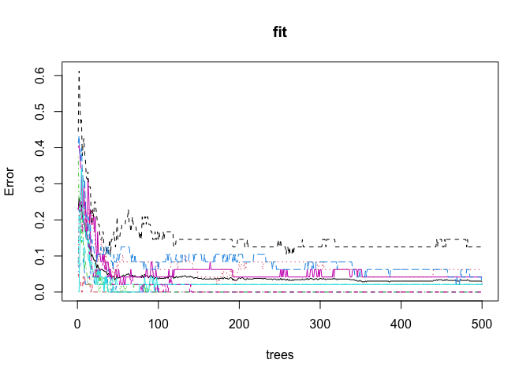
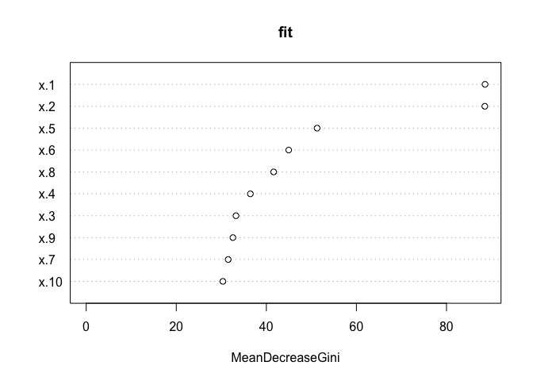

Homework6
================
Weixi Chen
3/26/2022

``` r
library('randomForest')  ## fit random forest
```

    ## Warning: package 'randomForest' was built under R version 4.1.2

    ## randomForest 4.7-1

    ## Type rfNews() to see new features/changes/bug fixes.

``` r
library('dplyr')    ## data manipulation
```

    ## 
    ## Attaching package: 'dplyr'

    ## The following object is masked from 'package:randomForest':
    ## 
    ##     combine

    ## The following objects are masked from 'package:stats':
    ## 
    ##     filter, lag

    ## The following objects are masked from 'package:base':
    ## 
    ##     intersect, setdiff, setequal, union

``` r
library('magrittr') ## for '%<>%' operator
library('gpairs')   ## pairs plot
library('viridis')  ## viridis color palette
```

    ## Loading required package: viridisLite

``` r
library('caret') ## 'createFolds'
```

    ## Loading required package: ggplot2

    ## 
    ## Attaching package: 'ggplot2'

    ## The following object is masked from 'package:randomForest':
    ## 
    ##     margin

    ## Loading required package: lattice

``` r
# load the dataset we need
vowel <- 
  read.table(url(
    'https://hastie.su.domains/ElemStatLearn/datasets/vowel.train'), sep = ",", header = TRUE)[,-1]
```

## Question1: Convert the type of response variable

``` r
vowel %<>%
  mutate_at(c('y'), as.factor)  
```

## Question2: Review “randomForest” document

``` r
?randomForest
```

## Question3: fit the random forest model

``` r
fit <- randomForest(x = vowel[,-1], y = vowel$y,  
                    ntree = 500, mtry = 3, proximity=TRUE)

print(fit)          ## summary of fit object
```

    ## 
    ## Call:
    ##  randomForest(x = vowel[, -1], y = vowel$y, ntree = 500, mtry = 3,      proximity = TRUE) 
    ##                Type of random forest: classification
    ##                      Number of trees: 500
    ## No. of variables tried at each split: 3
    ## 
    ##         OOB estimate of  error rate: 2.84%
    ## Confusion matrix:
    ##     1  2  3  4  5  6  7  8  9 10 11 class.error
    ## 1  48  0  0  0  0  0  0  0  0  0  0  0.00000000
    ## 2   1 47  0  0  0  0  0  0  0  0  0  0.02083333
    ## 3   0  0 48  0  0  0  0  0  0  0  0  0.00000000
    ## 4   0  0  0 47  0  1  0  0  0  0  0  0.02083333
    ## 5   0  0  0  0 46  1  0  0  0  0  1  0.04166667
    ## 6   0  0  0  1  0 42  0  0  0  0  5  0.12500000
    ## 7   0  0  0  0  1  0 45  2  0  0  0  0.06250000
    ## 8   0  0  0  0  0  0  0 48  0  0  0  0.00000000
    ## 9   0  0  0  0  0  0  1  0 47  0  0  0.02083333
    ## 10  0  0  0  0  0  0  1  0  0 47  0  0.02083333
    ## 11  0  0  0  0  0  0  0  0  0  0 48  0.00000000

``` r
plot(fit)           ## plot OOB MSE as function of # of trees
```

<!-- -->

``` r
importance(fit)     ## variable importance 
```

    ##      MeanDecreaseGini
    ## x.1          88.56241
    ## x.2          88.50972
    ## x.3          33.25765
    ## x.4          36.45448
    ## x.5          51.26899
    ## x.6          44.96237
    ## x.7          31.52461
    ## x.8          41.62957
    ## x.9          32.57308
    ## x.10         30.34618

``` r
varImpPlot(fit)     ## variable importance plot
```

<!-- -->

## Question4: 5-fold CV and model tuning

``` r
#split dataset
vowel_flds  <- createFolds(vowel$y, k=5)
print(vowel_flds)
```

    ## $Fold1
    ##   [1]  13  19  34  35  40  43  44  45  49  60  64  77  83  88  89  92  96 100
    ##  [19] 101 104 109 115 123 124 127 135 136 140 141 142 145 148 151 157 163 164
    ##  [37] 169 181 185 193 201 204 206 208 216 222 231 232 235 246 251 252 253 261
    ##  [55] 270 271 273 282 285 286 289 290 295 301 304 305 308 309 310 311 324 341
    ##  [73] 343 344 347 356 361 372 380 381 386 390 395 403 413 414 419 428 429 433
    ##  [91] 447 454 476 482 483 485 490 492 498 499 502 507 508 514 522
    ## 
    ## $Fold2
    ##   [1]   5   8  14  24  36  37  47  52  57  59  61  66  69  72  76  78  79  82
    ##  [19]  84  97  99 106 107 110 114 119 120 122 128 129 131 132 133 154 158 159
    ##  [37] 161 167 171 175 178 179 183 186 189 192 196 202 210 212 213 215 220 226
    ##  [55] 237 245 247 255 256 265 266 276 283 287 292 294 298 300 312 316 318 325
    ##  [73] 330 334 337 338 340 353 357 360 362 367 391 392 405 425 427 432 438 439
    ##  [91] 441 449 458 462 469 470 478 489 497 500 504 519 521 523 526 527 528
    ## 
    ## $Fold3
    ##   [1]   3   4   6   7  10  12  18  21  22  23  26  28  39  42  50  53  54  70
    ##  [19]  71  86  95 116 118 125 138 146 147 150 156 165 168 180 195 197 198 207
    ##  [37] 221 223 224 229 236 239 240 250 254 258 259 260 268 275 277 278 279 288
    ##  [55] 291 296 297 299 307 313 319 327 328 329 339 348 349 351 354 358 359 366
    ##  [73] 370 371 375 379 383 393 397 401 404 406 408 417 418 423 424 426 431 442
    ##  [91] 443 452 453 456 457 467 473 475 487 496 506 509 510 513 517
    ## 
    ## $Fold4
    ##   [1]   9  11  15  16  17  20  27  38  41  46  55  56  62  63  68  75  80  81
    ##  [19]  85  87  93  98 105 111 113 121 126 143 153 160 162 172 174 176 182 184
    ##  [37] 188 191 194 199 200 214 219 225 228 234 238 241 243 244 248 249 262 263
    ##  [55] 264 267 272 274 280 281 284 293 314 315 317 320 321 322 326 331 332 333
    ##  [73] 345 352 363 364 365 369 373 378 394 398 410 411 420 421 422 430 435 440
    ##  [91] 444 445 446 448 459 460 465 466 471 474 481 486 495 505 511 520 524
    ## 
    ## $Fold5
    ##   [1]   1   2  25  29  30  31  32  33  48  51  58  65  67  73  74  90  91  94
    ##  [19] 102 103 108 112 117 130 134 137 139 144 149 152 155 166 170 173 177 187
    ##  [37] 190 203 205 209 211 217 218 227 230 233 242 257 269 302 303 306 323 335
    ##  [55] 336 342 346 350 355 368 374 376 377 382 384 385 387 388 389 396 399 400
    ##  [73] 402 407 409 412 415 416 434 436 437 450 451 455 461 463 464 468 472 477
    ##  [91] 479 480 484 488 491 493 494 501 503 512 515 516 518 525

``` r
sapply(vowel_flds, length)  ## not all the same length
```

    ## Fold1 Fold2 Fold3 Fold4 Fold5 
    ##   105   107   105   107   104

### the number of variables randomly sampled as candidates at each split

``` r
set.seed(2)
split_num <- c(3, 4, 5)
cverr <- rep(NA, length(split_num))
for (i in 1:length(split_num)) {
  cverr1 <- rep(NA, length(vowel_flds))
  for(j in 1:length(vowel_flds)) { ## for each fold
    
    ## get training and testing data
    vowel_train <- vowel[-vowel_flds[[j]],]
    vowel_test <- vowel[ vowel_flds[[j]],]
    
    ## fit random forest model to training data
    randomforest_fit <- randomForest(x = vowel_train[,-1], y = vowel_train$y,  
                    ntree = 500, mtry = split_num[i], proximity=TRUE)
    
    ## compute test error on testing data
    pre_tst <- predict(randomforest_fit, vowel_test)
    cverr1[j] <- sum(pre_tst != vowel_test$y)/length(pre_tst)
  }
  cverr[i] <- mean(cverr1)
}
cverr
```

    ## [1] 0.03218565 0.03788265 0.03991356

So we should choose 3 as the number of variables randomly sampled as
candidates at each split.

### the minimum size of terminal nodes

``` r
set.seed(3)
node_size <- c(1, 5, 10, 20, 40, 80)
cverr <- rep(NA, length(node_size))
for (i in 1:length(node_size)) {
  cverr1 <- rep(NA, length(vowel_flds))
  for(j in 1:length(vowel_flds)) { ## for each fold
    
    ## get training and testing data
    vowel_train <- vowel[-vowel_flds[[j]],]
    vowel_test <- vowel[ vowel_flds[[j]],]
    
    ## fit random forest model to training data
    randomforest_fit <- randomForest(x = vowel_train[,-1], y = vowel_train$y,  
                    ntree = 500, mtry = 3, nodesize = node_size[i], proximity=TRUE)
    
    ## compute test error on testing data
    pre_tst <- predict(randomforest_fit, vowel_test[, -1])
    cverr1[j] <- sum(pre_tst != vowel_test$y)/length(pre_tst)
  }
  cverr[i] <- mean(cverr1)
}
cverr
```

    ## [1] 0.03024528 0.04357964 0.07017819 0.15543374 0.31451731 0.47363545

So we should choose 1 as the minimum size of terminal nodes。

## Question5: compute misclassification rate

``` r
# load the dataset we need
vowel_test <- 
  read.table(url(
    'https://hastie.su.domains/ElemStatLearn/datasets/vowel.test'), sep = ",", header = TRUE)[,-1]

vowel_test %<>%
  mutate_at(c('y'), as.factor)  
```

``` r
set.seed(4)
randomforest_fit <- randomForest(x = vowel[,-1], y = vowel$y, 
                    ntree = 500, mtry = 3, nodesize = 1,  importance=TRUE, proximity=TRUE)
    
## compute test error on testing data
pre_tst <- predict(randomforest_fit, vowel_test)
mis_rate = sum(pre_tst != vowel_test$y)/length(pre_tst)
mis_rate
```

    ## [1] 0.4004329

So the misclassification rate is 0.4004329.
